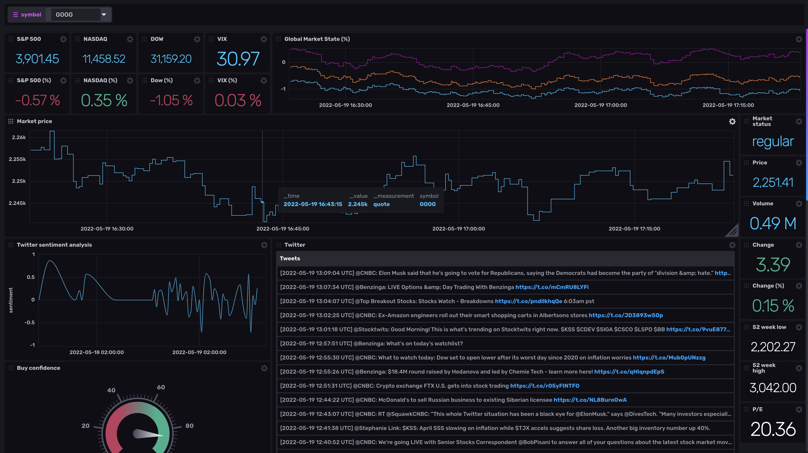

# Market Monitor

### Real time dashboard for monitoring stocks and crypto, with Twitter and Reddit sentiment analysis and useful market insights.

<p align="center">  </p>

# Install

Currently, only installation through docker is supported, so this steps assume that
you have docker installed in your machine. If you don't have it installed, check this 
link https://docs.docker.com/get-docker/

- Clone the project and navigate to it
```
git clone https://github.com/GabrielMusat/market-monitor.git && cd market-monitor
```
- Create your `.env` file. You can copy-paste `.env.example` and change the values.
It should contain this info:
```python
# INFLUXDB_TOKEN can be anything, but if you are going to expose the dashboard
# over a network, you may want to make this a secure string.
INFLUXDB_TOKEN="some-token"
# INFLUXDB_ADMIN_PASSWORD is the password that will be used to access the dashboard
# as the "admin" user. It must be at least 8 characters.
INFLUXDB_ADMIN_PASSWORD="more-than-8-chars"
# SYMBOLS is a comma sepparated list with the symbols you want to monitor
SYMBOLS="AAPL,TSLA,MSFT,GOOG,NVDA,AMD,NET"
# (optional) TWITTER_TOKEN is the bearer token of your twitter application
TWITTER_TOKEN="your-apps-bearer-token"
# (optional) reddit API configuration for gathering posts from reddit
REDDIT_CLIENT_ID="your-reddit-client-id"
REDDIT_CLIENT_SECRET="your-reddit-client-secret"
REDDIT_PASSWORD="your-reddit-password"
REDDIT_USERNAME="your-reddit-username"
```
> **_Note:_** Currently, the maximum number of symbols is 10
- Bring up the dependencies and leave them running in the background
```
docker compose up -d
```
- On your browser, go to http://localhost:8086 and login with username "admin" and
the password from your `.env` file under the `INFLUXDB_ADMIN_PASSWORD` key
- Once logged in, in the navigation bar at the left, go to "Boards", click on "Create Dashboard"
and on "Import Dashboards" in the dropdown. The file you want to import lives in the root directory
of this project, and its name is `dashboard.json`
- Once imported, a new dashboard named "Market" should be available

# Config changes

Edit your `.env` file with the new config. After that, just execute `docker compose up -d`

# Update

- Inside the cloned project directory, pull the latest changes `git pull`
- Rebuild and launch the docker images `docker compose up --build -d`

# Twitter sentiment analysis

If you configure the `TWITTER_TOKEN` in your `.env` file, you will get most recent tweets
from some well known accounts and perform sentiment analysis using AI on them. In order to
get one `TWITTER_TOKEN` you must create a developer account and an application on twitter.

In this link https://developer.twitter.com/apps you will find how to create one.
Once you have your application created: 
- In the developer portal, select your application
- Go to the "Keys and tokens" tab
- Copy the "Bearer Token" under "Authentication tokens"
- Paste it in the `TWITTER_TOKEN` field in your `.env` file

# Reddit posts sentiment analysis

If you configure the Reddit API env variables, you will get most recent reddit posts about
the market and perform sentiment analysis on them. You will need a Reddit account and a script
application created under that account. 
- **REDDIT_CLIENT_ID**: your application's client id
- **REDDIT_CLIENT_SECRET**: your application's client secret
- **REDDIT_PASSWORD**: your account's password
- **REDDIT_USERNAME**: your account's username

The application can be created here https://www.reddit.com/prefs/apps/.
For more detailed instructions on how to create a reddit app follow this link
https://praw.readthedocs.io/en/stable/getting_started/authentication.html#password-flow
# Customize

This project follows a plugin architecture, where it's easy to develop new plugins and extend
the data collection features with just a few lines of code. You can see [here](src/metric_collectors)
the current plugins that collect data from Yahoo finance api and Twitter.

Plugins are hooked up with the metrics collector [here](https://github.com/GabrielMusat/market-monitor/blob/main/src/main.py#L52-L66). The data collected by 
the plugins will be available to be displayed in the **InfluxDB** dashboard, which uses the
**flux** query language to gather and display data.

You can read more about **InfluxDB** and **flux** here https://docs.influxdata.com/influxdb/v2.2/


# Disclaimer

This project is for educational purposes only, use it at your own risk. The contributors
of this project assume no responsibility for your trading decisions or results. We advise
you to not risk any money that you are afraid to lose.
